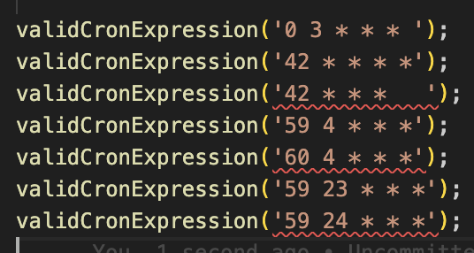

# ts-cron
A TypeScript type level CRON expression validator!



Expressions currently supported are standard cron expressions, such as the one generated and describe on [crontab.guru](https://crontab.guru) website. 
This type level validator works quite well in conjunction with cron engines such as [node-cron](https://github.com/kelektiv/node-cron).

## Usage
To install this tiny library: 
```
  
  npm install ts-cron-validator

```

Then you have the choice between using a conditional type CRON<'...'> directly or the helper function validCronExpression() as shown below:
```
import { validCronExpression } from 'ts-cron-validator';

validCronExpression('0 3 * * * ');      // OK padding accepted
validCronExpression('42 * * *   ');     // KO missing day of week part
validCronExpression('59 4 * * *');      // OK
validCronExpression('60 4 * * *');      // KO incorrect minutes part 
```